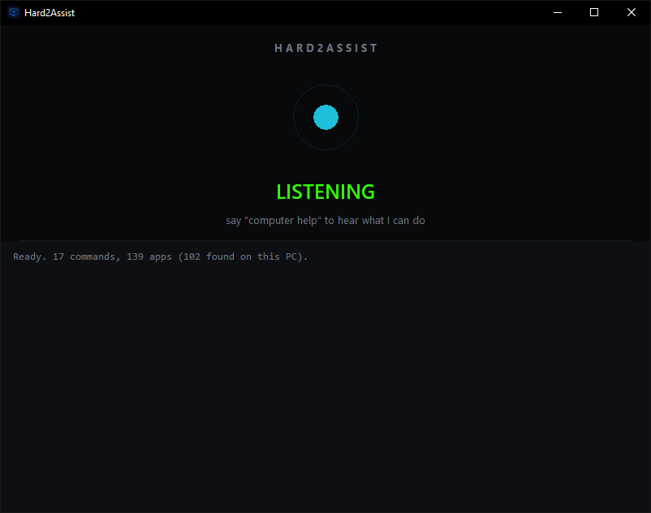
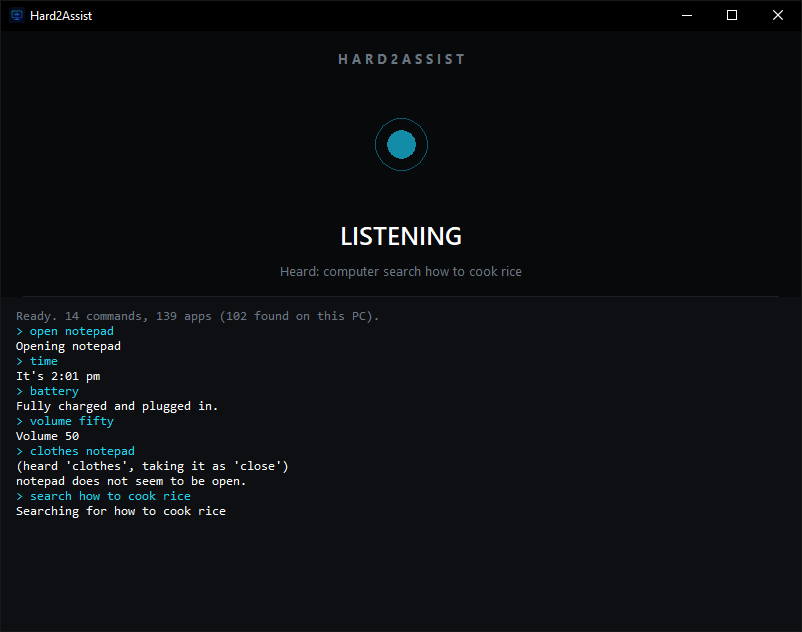
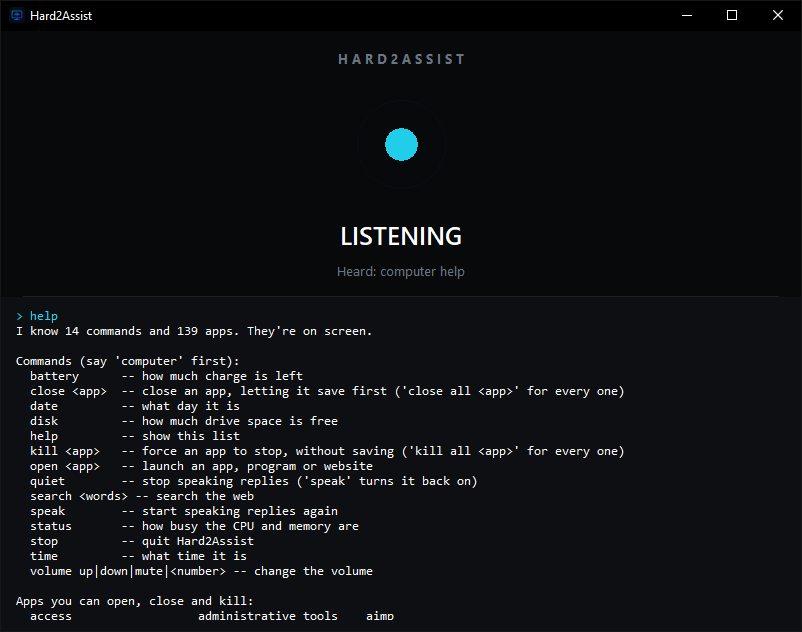

<div align="center">

# Hard2Assist

**WINDOWS VOICE ASSISTANT.**

Hard2Assist is a voice assistant for Windows. Say **"computer"** followed by a command
and it opens programs and websites, closes and minimizes windows, controls the volume,
and answers questions about your PC — battery, time, disk space, CPU load — out loud.
It installs from a single setup file and carries its own copy of Python, so there is
nothing else to install.

The first time you run it, it talks you through a short setup out loud — pick your own
wake word instead of "computer", and decide whether it listens all the time or only
while its window is in focus.



</div>

---

## Setup

### Option 1 — the installer (recommended)

Download (or build, see below) `Hard2Assist-Setup.exe` and run it. It asks where to
install, and whether you want a desktop shortcut. It does **not** ask for administrator
rights: by default it installs just for you, under `%LOCALAPPDATA%\Programs`.

You only need two things:

- 🎤 **a microphone**
- 🌐 **an internet connection** — recognition uses Google's free speech API

> **"Windows protected your PC"?** Click **More info → Run anyway**. Hard2Assist is not
> signed with a code-signing certificate, and Windows shows that warning for every
> unsigned program from a publisher it has not seen before. The certificates that remove
> it are a paid yearly subscription from a certificate authority.

### Option 2 — run from source

```
pip install -r requirements.txt
python hard2assist.py             # the window
python hard2assist.py --console   # the same thing in a terminal, no window
```

### Building it yourself

```
pip install -r requirements.txt
python build.py
```

That writes `dist\Hard2Assist\` — the app, with Python beside it. Open the
`Hard2Assist.exe` inside and say `computer help`: seeing every command listed is how you
know the build is complete, because a build missing a piece still starts and looks fine.

To wrap that folder into the installer, install
[Inno Setup](https://jrsoftware.org/isdl.php) (free, no account needed) and run:

```
python build.py --installer
```

which writes `installer\Hard2Assist-Setup.exe`, the single file to hand to anyone else.

<details>
<summary>Why a folder rather than one big .exe?</summary>

It used to be a single 57 MB `.exe`. PyInstaller builds those by appending a compressed
archive to a small launcher, so every single launch unpacked ~67 MB into `%TEMP%` before
the window could appear — about **4 seconds, every time**. Antivirus heuristics are also
suspicious of that shape, because writing executables into a temp folder and running them
is what droppers do.

Shipping a plain folder removes the unpacking step entirely (**~0.5 s to the window**),
and the installer keeps the download a single file. Dropping the unused offline speech
models and NumPy at the same time took the app from 67 MB to 29 MB.

</details>

---

## How to use

Start Hard2Assist, wait for **LISTENING**, then say **"computer"** followed by what
you want:

| Say this | And it |
| --- | --- |
| `computer open notepad` | launches an app, a program, or a website |
| `computer open obs studio` | opens anything in your Start Menu — no setup |
| `computer open youtube` | opens the site in your browser |
| `computer focus notepad` | brings it to the front, even if it was minimised |
| `computer minimize notepad` | sends it to the taskbar — the opposite of `focus` |
| `computer close notepad` | closes it, letting it save first |
| `computer kill notepad` | forces it to stop |
| `computer time` | 🔊 *"It's 8:02 pm"* |
| `computer date` | 🔊 *"It's Friday, August 8"* |
| `computer battery` | 🔊 *"82 percent, charging"* |
| `computer status` | 🔊 *"CPU 12 percent, memory 46 percent"* |
| `computer disk` | 🔊 *"C has 58 gigabytes free"* |
| `computer volume 50` | sets it to exactly 50%. "fifty" works too |
| `computer volume up` | louder. `down` and `mute` too |
| `computer search how to cook rice` | opens the results in your browser |
| `computer help` | lists everything it knows |
| `computer customize` | change the wake word and how it listens |
| `computer stop` | quits |

Every command confirms what it did, and the log keeps the whole conversation:

<div align="center">

</div>

A few things worth knowing while you use it:

- **It sets itself up by talking to you.** On the very first run it asks two questions
  out loud, explains each one, reads your answer back, and waits for you to confirm it
  before saving. Say `computer customize` to go through it again, and say **keep** to
  leave any single answer alone. If it mishears three times it keeps the current value,
  says so, and moves on — a bad microphone costs you a setting, never the whole app.

  Your answers live in `%APPDATA%\Hard2Assist\settings.json`. Delete that file to be
  asked again from scratch.

  - **Your wake word.** Any single word of three letters or more. Pick `jarvis` and it
    answers to `jarvis open notepad`, and to nothing else.
  - **When it listens.** *Always* is hands free but the microphone is live whenever the
    app is running. *Only when in focus* means it ignores everything until you click its
    window — more private, but you have to click first. The window says **NOT IN FOCUS**
    while it is deliberately ignoring you, so it never looks broken.

- **It talks back.** Short answers are spoken; long lists are written to the window
  instead, so `computer help` says *"I know 17 commands and 140 apps, they're on screen"*
  rather than reading all of them out. Say `computer quiet` to silence it and
  `computer speak` to turn the voice back on.

- **It knows what is on your PC.** Every shortcut in your Start Menu is found at
  startup — over a hundred programs on a typical machine — so `computer open obs studio`
  works without any configuration. Install something new and it works next time you
  start. Say `computer help` to see the full list:

  <div align="center">
  
  </div>

- **If it does not know something, it asks.** Say `computer open photoshop` for a
  program it has not found and a file picker opens. Click the program once and it is
  remembered forever, in `%APPDATA%\Hard2Assist\my-apps.json`. (You cannot dictate
  `C:\Program Files\...` out loud, so it does not ask you to.)

- **It expects to be misheard.** Speech recognition hears **"clothes"** when you say
  **"close"**, nearly every time. Commands carry a list of what they actually get
  misheard as, and anything still unmatched goes through fuzzy matching. It always
  tells you when it corrects something — you can see it in the screenshot above:

  ```
  > clothes notepad
  (heard 'clothes', taking it as 'close')
  ```

  App names get the same treatment: `computer open ccleaner` finds *CCleaner 7*, and
  `computer open obs` finds *OBS Studio*.

- **`close` closes the right window.** `close cmd` closes the **most recently opened**
  cmd, so opening one by voice and closing it leaves the one you were already working
  in alone. `close all cmd` closes every one.

- **It does not hear itself.** While it speaks, the microphone is off. Otherwise it
  would hear *"Closing one window"*, pick the word *close* out of it, and set off again.

---

## Adding your own

### A command

Drop a file in any folder under `commands/`:

```python
from output import say

NAME = "greet"
TAKES_ARG = False
ALIASES = ("greeting", "great")   # what the recogniser might hear instead
HELP = "greet        -- say hello"

def run():
    say("Hello!")
```

It is picked up on the next start and `help` lists it automatically. Use
`TAKES_ARG = True` and `run(argument)` to receive the rest of the sentence.

**`say()` writes and speaks. `detail()` only writes.** Speaking is the default so a new
command is never accidentally silent — reach for `detail()` only when the output is a
list or a long explanation nobody would want read aloud.

This works with the installed app too. Put the file in a `commands\<group>\` folder in
either of these, then restart — no rebuild needed:

- `%APPDATA%\Hard2Assist\commands\` — always works, whatever folder you installed to
- next to `Hard2Assist.exe` — only if you can write to the install folder, which you
  cannot under `Program Files`

### An app or a website

One line in `apps/system.py` or `apps/websites.py`:

```python
App("notepad", "notepad", "Notepad")
#    name      launch      window title

site("youtube", "https://www.youtube.com")
```

`launch` goes to the Windows shell, so an exe, a `.msc` console, a `ms-settings:` URI,
a `.lnk` shortcut or a URL all work.

---

## Project layout

```
hard2assist.py      entry point -- the window, or --console
gui.py              the window
theme.py            colours and fonts, all in one place
listener.py         the microphone loop
speech.py           the voice
settings.py         what the user chose, saved between runs
wizard.py           the spoken setup conversation
registry.py         finds commands, works out which one you meant
output.py           say() writes and speaks, detail() only writes
ask.py              asking you for a file mid-command
win.py              the only Windows API code
audio.py            reading and setting the exact volume
build.py            builds the app folder, and the installer
installer.iss       the installer, for Inno Setup

commands/
  TextCommands/     answers      help time date battery status disk
  AppCommands/      acting       open focus minimize close kill
  Controls/         the PC       volume quiet speak stop customize
  Web/              online       search

apps/
  app.py            what an app is -- name, how to launch it, how to find its window
  system.py         built into Windows
  installed.py      found in your Start Menu, plus ones you picked
  websites.py       sites
```

---

## Known limits

- **Elevated apps.** Device Manager, Services, Registry Editor and friends can run as
  administrator. Windows will not let a normal program send window messages to one, so
  `close` reports that it was refused rather than pretending. `kill` usually still
  works. Run Hard2Assist as administrator to `close` them.
- **Focus can be refused.** Windows does not let a background program take the
  foreground in every situation. When it refuses, `focus` says so rather than
  pretending, and the app's taskbar button flashes instead.
- **Closing Start Menu programs is best-effort.** They are found by window title, which
  does not always match the shortcut name. Programs you pick yourself are matched by
  their process and close reliably. Opening always works.
- **Speech needs the internet.** Listening goes to Google's free speech API, so
  Hard2Assist does not work offline. This is deliberate: an offline recogniser accurate
  enough to be worth using costs far more in size and accuracy than it saves. The voice
  that answers you is Windows' own and never leaves your PC — it is only the listening
  that needs a connection.
