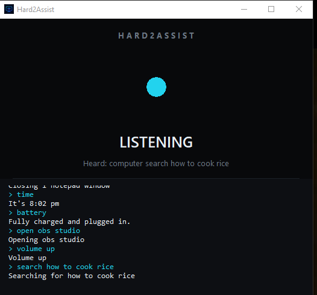

<div align="center">

# Hard2Assist

**Talk to your PC. It listens, does the thing, and tells you it did.**

A voice commander for Windows. One file to run, nothing to install.



</div>

---

## What it does

Say **"computer"**, then what you want.

| Say this | And it |
| --- | --- |
| `computer open notepad` | launches an app, a program, or a website |
| `computer open obs studio` | opens anything in your Start Menu -- no setup |
| `computer open youtube` | opens the site in your browser |
| `computer close notepad` | closes it, letting it save first |
| `computer kill notepad` | forces it to stop |
| `computer time` | 🔊 *"It's 8:02 pm"* |
| `computer battery` | 🔊 *"82 percent, charging"* |
| `computer status` | 🔊 *"CPU 12 percent, memory 46 percent"* |
| `computer disk` | 🔊 *"C has 58 gigabytes free"* |
| `computer volume 50` | sets it to exactly 50%. "fifty" works too |
| `computer volume up` | louder. `down` and `mute` too |
| `computer play` | play or pause whatever is playing |
| `computer next` | skip a track. `back` for the previous one |
| `computer search how to cook rice` | opens the results in your browser |
| `computer help` | lists everything it knows |
| `computer stop` | quits |

It **talks back**. Everything short is spoken; long lists are written to the window
instead, so `computer help` says *"I know 17 commands and 139 apps, they're on screen"*
rather than reading all of them out. Say `computer quiet` to stop it, `computer speak`
to start again.

---

## Getting started

Download or build `Hard2Assist.exe`, then double-click it. That is the whole setup --
Python and every library are packed inside the file, so it runs on a Windows PC with
nothing installed.

It needs two things:

- **a microphone**
- **an internet connection**, because recognition uses Google's free speech API

---

## The things it does well

### It knows what is on your PC

Every shortcut in your Start Menu is found at startup -- over a hundred programs on a
typical machine -- so `computer open obs studio` works without you configuring anything.
Install something new and it works next time you start.

### If it does not know something, it asks

Say `computer open photoshop` for a program it has not found, and it opens a file picker.
Click the program once and it is remembered forever, in
`%APPDATA%\Hard2Assist\my-apps.json`.

You cannot dictate `C:\Program Files\...` out loud, so it does not ask you to.

### It expects to be misheard

Speech recognition hears **"clothes"** when you say **"close"**, nearly every time. So
commands carry a list of what they actually get misheard as, and anything still unmatched
goes through fuzzy matching. It tells you when it corrects something:

```
> clothes notepad
(heard 'clothes', taking it as 'close')
Closing 1 notepad window
```

App names get the same treatment -- `computer open ccleaner` finds *CCleaner 7*, and
`computer open obs` finds *OBS Studio*.

### `close` closes the right window

`close cmd` closes the **most recently opened** cmd, so opening one by voice and closing it
leaves the one you were already working in alone. `close all cmd` closes every one.

### It does not hear itself

While it speaks, the microphone is off. Otherwise it hears *"Closing one window"*, picks the
word *close* out of it, and sets off again.

---

## Building it

```
pip install -r requirements.txt
python build.py
```

That writes `dist\Hard2Assist.exe`. Copy that one file anywhere.

To run from source instead:

```
python hard2assist.py             # the window
python hard2assist.py --console   # the same thing in a terminal, no window
```

After building, open the .exe and say `computer help`. A build missing a piece still starts
and still opens its window, so seeing every command listed is what tells you it is complete.

---

## Adding your own

### A command

Drop a file in any folder under `commands/`:

```python
from output import say

NAME = "greet"
TAKES_ARG = False
ALIASES = ("greeting", "great")   # what the recogniser might hear instead
HELP = "greet        -- say hello"

def run():
    say("Hello!")
```

It is picked up next start and `help` lists it automatically. Use `TAKES_ARG = True` and
`run(argument)` to get the rest of the sentence.

**`say()` writes and speaks. `detail()` only writes.** Speaking is the default so a new
command is never accidentally silent -- reach for `detail()` only when the output is a
list or a long explanation nobody would want read aloud.

This works with the built .exe too -- put a `commands` folder next to `Hard2Assist.exe`,
drop the file in, restart. No rebuild.

### An app or a website

One line in `apps/system.py` or `apps/websites.py`:

```python
App("notepad", "notepad", "Notepad")
#    name      launch      window title

site("youtube", "https://www.youtube.com")
```

`launch` goes to the Windows shell, so an exe, a `.msc` console, a `ms-settings:` URI, a
`.lnk` shortcut or a URL all work.

---

## Where things live

```
hard2assist.py      entry point -- the window, or --console
gui.py              the window
theme.py            colours and fonts, all in one place
listener.py         the microphone loop
speech.py           the voice
registry.py         finds commands, works out which one you meant
output.py           say() writes and speaks, detail() only writes
ask.py              asking you for a file mid-command
win.py              the only Windows API code
audio.py            reading and setting the exact volume
build.py            builds the .exe

commands/
  TextCommands/     answers      help time date battery status disk
  SystemApps/       acting       open close kill
  Controls/         the PC       volume play next back quiet speak stop
  Web/              online       search

apps/
  app.py            what an app is -- name, how to launch it, how to find its window
  system.py         built into Windows
  installed.py      found in your Start Menu, plus ones you picked
  websites.py       sites
```

---

## Known limits

- **Elevated apps.** Device Manager, Services, Registry Editor and friends can run as
  administrator. Windows will not let a normal program send window messages to one, so
  `close` reports that it was refused rather than pretending. `kill` usually still works.
  Run Hard2Assist as administrator to `close` them.
- **Closing Start Menu programs is best-effort.** They are found by window title, which does
  not always match the shortcut name. Programs you pick yourself are matched by their
  process and close reliably. Opening always works.
- **Speech needs the internet.** There is no offline recognition.
